# 🎯 SumItUp - Intelligent Content Summarization Platform

<div align="center">


**Transform any content into concise, intelligent summaries**

[](https://opensource.org/licenses/MIT)
[](https://nodejs.org/)
[](https://reactnative.dev/)
[](https://www.mongodb.com/)
[](./backend/tests/)

</div>

---

## 🌟 **What is SumItUp?**

SumItUp is an **AI-powered content summarization platform** that transforms various types of media into concise, intelligent summaries. Whether you're dealing with audio recordings, images, videos, PDFs, web articles, or books, SumItUp uses advanced machine learning to extract key insights and present them in an easily digestible format.

### 🎯 **Core Purpose**

In today's information-rich world, we're constantly overwhelmed by content. SumItUp solves this by:

- **🚀 Accelerating Learning**: Get key insights in seconds, not hours
- **📱 Mobile-First Design**: Access summaries anywhere, anytime
- **🤖 AI-Powered Intelligence**: Leverage cutting-edge NLP and ML technologies
- **💰 Token Economy**: Earn rewards and customize your experience
- **🎨 Personalization**: Tailored summaries based on your preferences

---

## 🏗️ **System Architecture**

### **High-Level Architecture Overview**


### **Request Flow Example: Audio Summarization**


---

## 🎨 **Content Processing Pipeline**

### **Multi-Modal Content Support**


### **🔧 Processing Technologies**

| Content Type | Technology Stack | Processing Method |
|--------------|------------------|-------------------|
| **🎵 Audio** | DeepSpeech + Natural NLP | Speech-to-text → Text summarization |
| **🖼️ Images** | OCR + Computer Vision | Text extraction → Content analysis |
| **🎬 Videos** | Frame analysis + Audio extraction | Multi-modal processing |
| **🌐 URLs** | Web scraping + Content parsing | HTML parsing → Text extraction |
| **📚 Books** | NLP + Text analysis | Chapter-wise summarization |
| **📄 PDFs** | PDF parsing + OCR | Text extraction → Summarization |

---

## 👤 **User Experience & Features**

### **Feature Architecture**


### **🌟 Key Features**

#### **🔐 User Authentication & Security**
- **Secure Registration**: Email verification with JWT tokens
- **Multi-factor Authentication**: Enhanced security options
- **Password Recovery**: Secure reset mechanisms
- **Session Management**: Automatic token refresh

#### **🎯 Content Summarization**
- **Multi-format Support**: 7+ content types supported
- **Customizable Length**: Short, medium, or detailed summaries
- **Style Options**: Bullet points, paragraphs, or key insights
- **Language Support**: Multiple language processing
- **Quality Settings**: Balance between speed and accuracy

#### **💰 Token Economy System**
- **Earn Tokens**: Watch personalized ads to earn credits
- **Spend Tokens**: Use credits for ad-free experience
- **Dynamic Pricing**: Token costs based on processing complexity
- **Reward System**: Bonus tokens for engagement

#### **📊 Content Management**
- **History Tracking**: All your summaries in one place
- **Favorites System**: Save important summaries
- **Smart Tagging**: Automatic and manual content categorization
- **Advanced Search**: Find summaries by content, tags, or date
- **Export Options**: PDF generation for sharing

#### **🎨 Personalization**
- **User Preferences**: Customize summary style and length
- **Interest Tracking**: Personalized content recommendations
- **Theme Options**: Light/dark mode and custom themes
- **Notification Settings**: Control when and how you're notified

---

## 🗄️ **Database Architecture**

### **Data Model Overview**

```mermaid
graph TB
    subgraph "Database Schema"
        subgraph "Users Collection"
            USER["User Document<br/>• _id<br/>• username<br/>• email<br/>• password (hashed)<br/>• tokens<br/>• adEligible<br/>• isVerified<br/>• createdAt<br/>• updatedAt"]
        end
        
        subgraph "Content Collection"
            CONTENT["Content Document<br/>• _id<br/>• userId (ref)<br/>• title<br/>• originalContent<br/>• summary<br/>• contentType<br/>• tags[]<br/>• isFavorite<br/>• isPublic<br/>• createdAt<br/>• updatedAt"]
        end
        
        subgraph "UserPreferences Collection"
            PREFS["UserPreferences Document<br/>• _id<br/>• userId (ref)<br/>• defaultSummaryLength<br/>• summaryStyle<br/>• preferredLanguage<br/>• interests[]<br/>• theme<br/>• notifications<br/>• processingQuality<br/>• createdAt<br/>• updatedAt"]
        end
        
        subgraph "Files Collection"
            FILES["File Document<br/>• _id<br/>• userId (ref)<br/>• filename<br/>• originalName<br/>• mimeType<br/>• size<br/>• path<br/>• uploadDate<br/>• metadata"]
        end
    end
    
    subgraph "Relationships"
        USER -->|"1:N"| CONTENT
        USER -->|"1:1"| PREFS
        USER -->|"1:N"| FILES
        CONTENT -->|"N:1"| FILES
    end
```



### **📋 Database Collections**

| Collection | Purpose | Key Features |
|------------|---------|--------------|
| **Users** | User account management | Authentication, token balance, ad eligibility |
| **Content** | Summarized content storage | Original content, summaries, metadata, tags |
| **UserPreferences** | Personalization settings | Summary preferences, themes, interests |
| **Files** | File metadata and storage | Upload tracking, file management, metadata |

---

## 🛠️ **Technology Stack**

### **Backend Technologies**

| Technology | Purpose | Version |
|------------|---------|---------|
| **Node.js** | Runtime environment | 18+ |
| **Express.js** | Web framework | 4.18+ |
| **MongoDB** | Primary database | 6.0+ |
| **Mongoose** | ODM for MongoDB | 7.0+ |
| **JWT** | Authentication | 9.0+ |
| **Multer** | File upload handling | 1.4+ |
| **DeepSpeech** | Speech recognition | 0.9+ |
| **Natural** | NLP processing | 6.0+ |
| **PDFKit** | PDF generation | 0.13+ |

### **Frontend Technologies**

| Technology | Purpose | Version |
|------------|---------|---------|
| **React Native** | Mobile framework | 0.72+ |
| **TypeScript** | Type safety | 5.0+ |
| **React Navigation** | Navigation | 6.0+ |
| **Async Storage** | Local storage | 1.19+ |
| **React Hook Form** | Form management | 7.45+ |

### **Testing & Quality**

| Tool | Purpose | Coverage |
|------|---------|----------|
| **Mocha** | Test framework | Unit & Integration |
| **Chai** | Assertion library | BDD/TDD assertions |
| **Sinon** | Mocking & spying | Service mocking |
| **NYC** | Code coverage | 90%+ target |
| **ESLint** | Code linting | Airbnb config |

---

## 🚀 **Getting Started**

### **📋 Prerequisites**

- **Node.js** 18+ 
- **MongoDB** 6.0+
- **React Native** development environment
- **Redis** (optional, for caching)

### **⚡ Quick Setup**

1. **Clone the Repository**
   ```bash
   git clone https://github.com/m-a-y-a-n-k/SumItUp.git
   cd SumItUp
   ```

2. **Backend Setup**
   ```bash
   cd backend
   npm install
   
   # Create environment file
   cp .env.example .env
   # Edit .env with your configuration
   
   npm start
   ```

3. **Frontend Setup**
   ```bash
   cd ../frontend
   npm install
   
   # For iOS
   npx react-native run-ios
   
   # For Android
   npx react-native run-android
   ```

### **🔧 Environment Configuration**

Create a `.env` file in the backend directory:

```env
# Server Configuration
PORT=3000
NODE_ENV=development

# Database
MONGODB_URI=mongodb://localhost:27017/sumitup

# Authentication
JWT_SECRET=your-super-secret-jwt-key
JWT_EXPIRES_IN=7d

# External Services
OPENAI_API_KEY=your-openai-key
GOOGLE_CLOUD_KEY=your-google-cloud-key

# Email Service
SMTP_HOST=smtp.gmail.com
SMTP_PORT=587
SMTP_USER=your-email@gmail.com
SMTP_PASS=your-app-password

# File Storage
UPLOAD_PATH=./uploads
MAX_FILE_SIZE=50MB

# Cache (Optional)
REDIS_URL=redis://localhost:6379
```

---

## 📊 **API Documentation**

### **🔗 Core Endpoints**

| Endpoint | Method | Purpose | Auth Required |
|----------|--------|---------|---------------|
| `/api/auth/signup` | POST | User registration | ❌ |
| `/api/auth/login` | POST | User authentication | ❌ |
| `/api/summary/generate/audio` | POST | Audio summarization | ✅ |
| `/api/summary/generate/image` | POST | Image summarization | ✅ |
| `/api/summary/generate/video` | POST | Video summarization | ✅ |
| `/api/content/history` | GET | User content history | ✅ |
| `/api/files/upload` | POST | File upload | ✅ |
| `/api/token/earn` | POST | Earn tokens | ✅ |
| `/api/user/preferences` | GET/PUT | User preferences | ✅ |

### **📖 Interactive Documentation**

After starting the server, visit:
- **Swagger UI**: `http://localhost:3000/api-docs`
- **API Reference**: [Full API Documentation](./backend/API_DOCUMENTATION.md)

---

## 🧪 **Testing**

### **🎯 Test Coverage**

```bash
# Run all tests
npm run test:unit

# Run specific test suites
npm run test:unit:controllers
npm run test:unit:models
npm run test:unit:services

# Generate coverage report
npm run test:coverage

# Watch mode for development
npm run test:watch
```

### **📈 Current Test Stats**

- **Total Tests**: 158
- **Passing**: 158 (100%)
- **Coverage**: 90%+
- **Test Types**: Unit, Integration, E2E

---

## 🤝 **Contributing**

We welcome contributions! Please see our [Contributing Guide](CONTRIBUTING.md) for details.

### **🔄 Development Workflow**

1. Fork the repository
2. Create a feature branch: `git checkout -b feature/amazing-feature`
3. Make your changes and add tests
4. Ensure all tests pass: `npm run test:unit`
5. Commit your changes: `git commit -m 'Add amazing feature'`
6. Push to the branch: `git push origin feature/amazing-feature`
7. Open a Pull Request

### **📝 Code Standards**

- **ESLint**: Airbnb configuration
- **Prettier**: Code formatting
- **Conventional Commits**: Commit message format
- **Test Coverage**: Minimum 80% for new features

---

## 📄 **License**

This project is licensed under the **MIT License** - see the [LICENSE](LICENSE.md) file for details.

---

## 🙏 **Acknowledgments**

- **OpenAI** for GPT integration
- **Mozilla** for DeepSpeech technology
- **MongoDB** for database solutions
- **React Native** community for mobile framework
- **Open Source** contributors worldwide

---

## 📞 **Support & Contact**

- **📧 Email**: support@sumitup.com
- **🐛 Issues**: [GitHub Issues](https://github.com/m-a-y-a-n-k/SumItUp/issues)
- **💬 Discussions**: [GitHub Discussions](https://github.com/m-a-y-a-n-k/SumItUp/discussions)
- **📖 Documentation**: [Wiki](https://github.com/m-a-y-a-n-k/SumItUp/wiki)

---

<div align="center">

**⭐ Star this repository if you find it helpful!**

Made with ❤️ by the SumItUp Team

</div>
